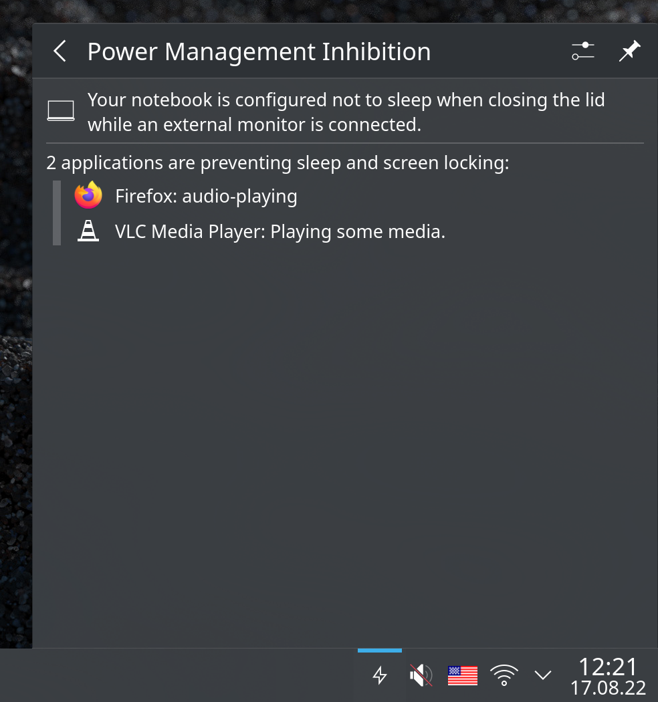

# Power Management Inhibition

This KDE Plasma 5 applet let you see information about power management inhibition. Available in the [KDE Store](https://store.kde.org/p/1426768).



Install:
```
    plasmapkg2 -i pminhibition.plasmoid
```
Remove:
```
    kpackagetool5 -t Plasma/Applet --remove org.kde.plasma.pminhibition
```
### Support

[](https://www.buymeacoffee.com/popov895a)
